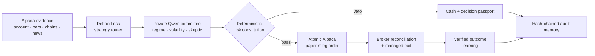
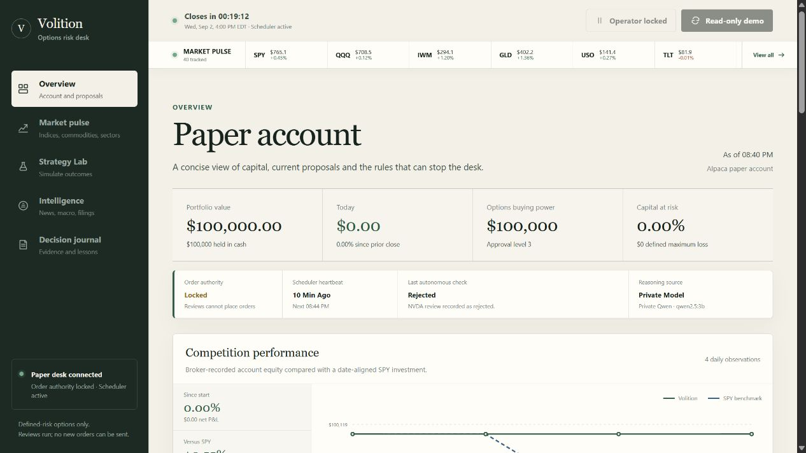
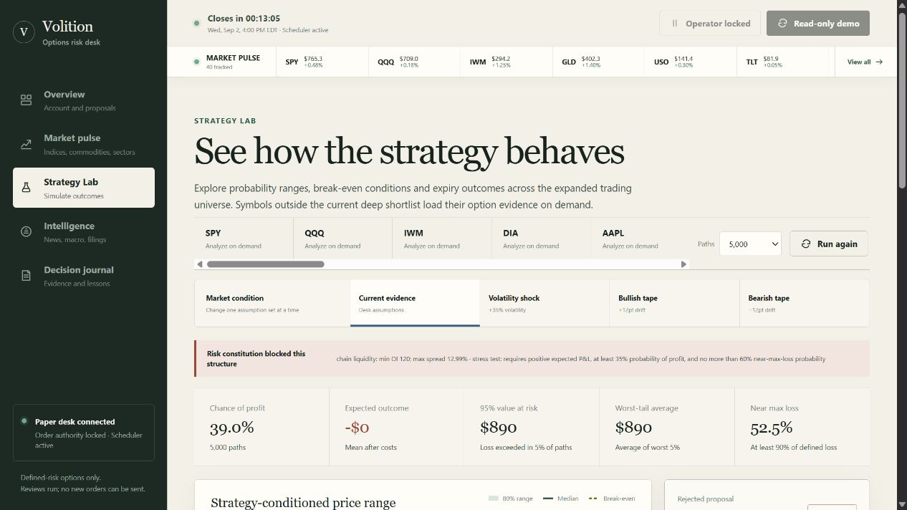
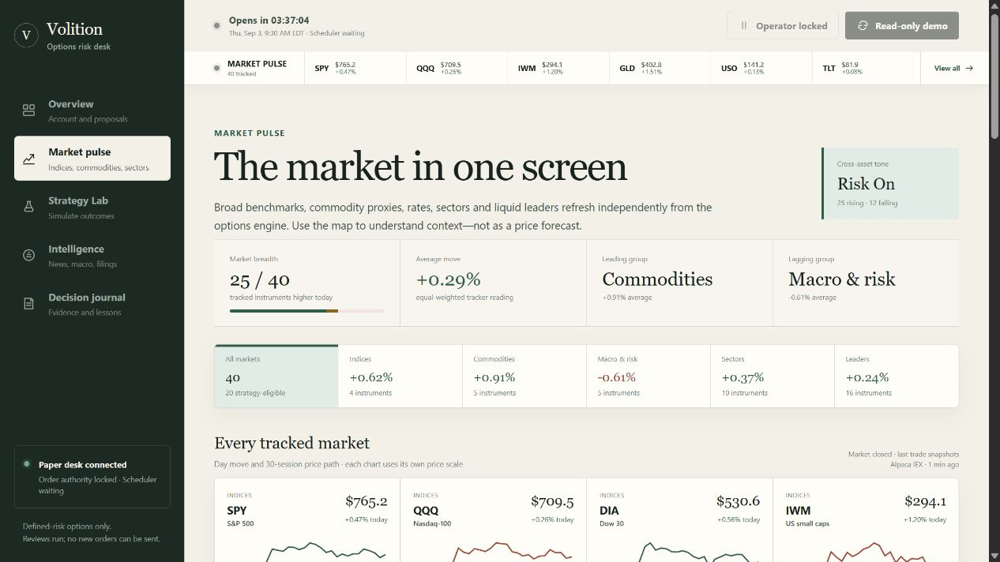
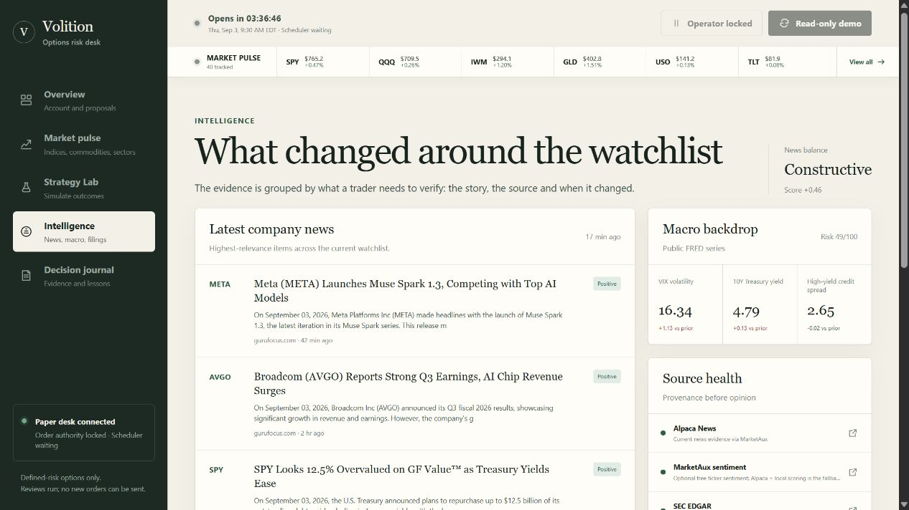
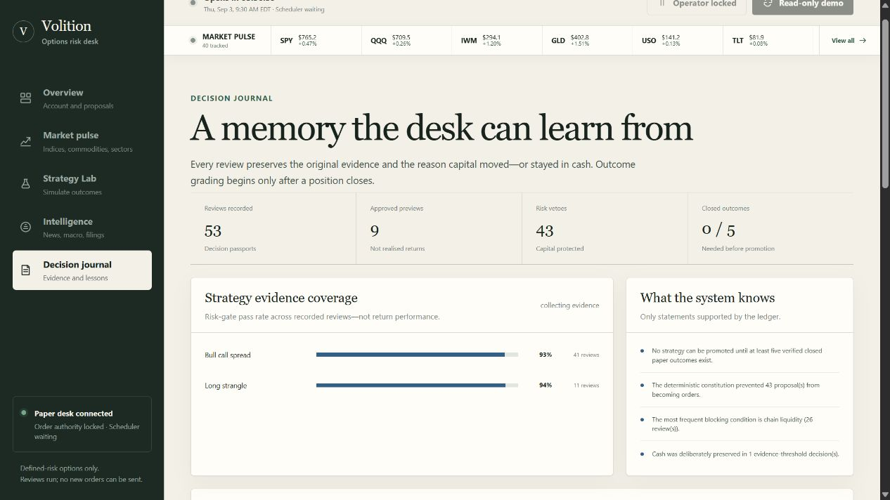
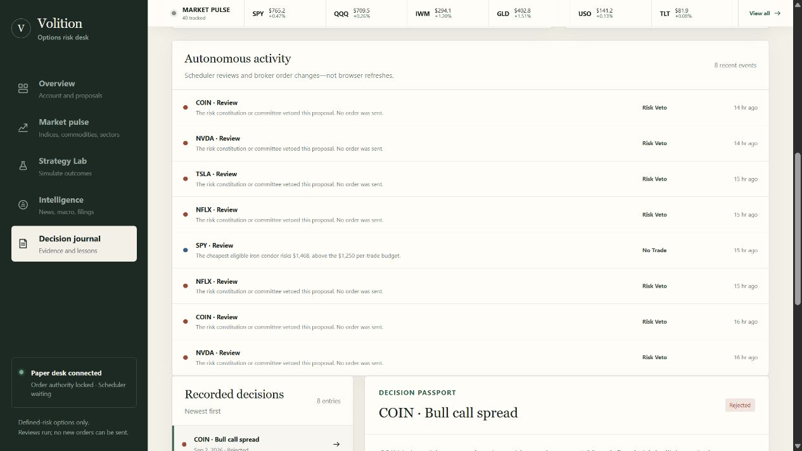

# Volition

**An autonomous, audit-first options risk desk for the Alpaca AI Trading Agents Hackathon.**

[](https://instance-20260318-1838.tail042e87.ts.net/)
[](https://alpaca.markets/)
[](#paper-safe-by-construction)
[](.github/workflows/ci.yml)


**[Open the live judge build](https://instance-20260318-1838.tail042e87.ts.net/)** · **[Watch the narrated walkthrough](docs/Volition_Demo_Walkthrough.mp4)** · **[Read the architecture brief](docs/HACKATHON_ONE_PAGER.md)**

## Current proof, not hype

| Autonomous evidence | Risk and coverage | Delivery |
| --- | --- | --- |
| 53 hash-chained reviews | 16 deterministic checks | 15-minute scheduler |
| 43 recorded risk vetoes | 20-symbol trade universe | 40-market context tape |
| Private Qwen committee | Alpaca Level 3 paper account | Public HTTPS judge build |

The live numbers above are operational evidence, not a claim of realised alpha.
The account remains at $100,000 in cash while paper order authority is locked.

Volition turns market evidence into risk-defined options structures, routes every candidate through an independent AI committee and a deterministic risk constitution, then executes eligible orders in a dedicated Alpaca paper account. Every decision—including “no trade”—produces a tamper-evident decision passport containing the evidence, agent debate, gates, proposed legs, and Alpaca receipt.

## Why this entry is different

Most trading-agent demos stop at a recommendation or let an LLM call an order API directly. Volition is built around five judge-visible promises:

1. **Options are the product, not a checkbox.** The router chooses among bull call spreads, bear put spreads, iron condors, long-volatility structures, and cash.
2. **The model cannot bypass risk.** Position size, liquidity, drawdown, expiry, account level, concentration, and defined-risk checks are deterministic and unit-tested.
3. **“No trade” is a successful autonomous outcome.** Rejected opportunities and the exact blocking gates remain visible.
4. **Every decision is auditable.** Hash-chained decision passports preserve the original evidence; a separate append-only lifecycle stream records submissions, broker updates, fills, cancellations, and exits.
5. **The demo proves the full loop honestly.** Account/position/option-chain evidence comes through the Alpaca CLI; atomic multi-leg paper orders use Alpaca's Trading API, and a submitted order is never labelled as a fill.

The News Intelligence panel enriches that loop with ticker-level sentiment and
catalyst classification. Alpaca News works immediately; optional free adapters
add MarketAux entity sentiment, SEC EDGAR filing events, and FRED macro regime
signals. See [the free API strategy map](docs/FREE_API_STRATEGY_MAP.md) for the
source hierarchy, caching policy, and remaining strategy-lab sequence.

The Strategy Lab now runs a reproducible Monte Carlo stress test against the
exact option legs proposed by the router. It simulates 1,000–20,000 underlying
paths, settles every leg at expiry, deducts an estimated half-spread cost, and
reports probability of profit, value at risk, expected shortfall, path bands,
and the full expiry P&L distribution. The UI exposes the volatility, drift,
slippage, seed, and model limitations rather than presenting the result as a
forecast.

The paper dashboard also includes a continuously refreshed 40-instrument Market
Pulse covering broad-index ETFs, commodity proxies, rates and risk, sectors,
and liquid market leaders. Batch snapshots keep that read lightweight while
30-session paths, breadth and leading/lagging groups make cross-asset movement
easy to scan. A 20-symbol trading universe is ranked with this lightweight
evidence first; only five names load full option chains and committee evidence
per cycle. A one-hour post-review cooldown prevents a single candidate from
monopolising consecutive cycles. It also includes grouped option-position
monitoring with profit, loss, and expiration exit policies, persistent scheduler
heartbeat/health, duplicate-entry protection, and an evidence-only Learning Journal. Previewed
and rejected decisions are never presented as realised performance. A strategy
cannot be promoted until the desk has at least five verified closed paper
outcomes, and scheduled reviews pause while the market is closed so the audit
ledger is not flooded with duplicate window vetoes.

The Performance panel is sourced from Alpaca's portfolio-history endpoint and
aligns the paper account with SPY on the same dates. It shows since-start return,
P&L, excess return, and maximum drawdown, and deliberately renders an evidence
gap instead of inventing a trend when fewer than two broker observations exist.

The Strategy Lab is available for every watchlist symbol. Current trade
candidates and research-only challengers are labelled separately, then tested
under current-evidence, volatility-shock, bullish-tape, and bearish-tape
conditions. The result shows a price fan, estimated break-even regions, expiry
condition probabilities, and milestone probabilities. Alpaca's market clock
drives a live open/close countdown. A 2,500-path base stress test is also a
blocking autonomous execution gate; simulation evidence can veto a trade but
can never bypass the risk constitution. Strategy Lab applies the same structural,
liquidity, sizing, permission, and freshness gates and labels failed candidates
as risk-blocked rather than implying they are executable.

## Agent loop



AI interprets evidence. Code alone owns contract geometry, quantity, risk,
permission, and final authority.

The AI committee accepts any OpenAI-compatible endpoint. The hosted deployment
runs Qwen 2.5 3B privately through Ollama on the Oracle server; a deterministic
fallback keeps the risk loop available if inference fails. Every opinion and
the operations strip label the actual source clearly.

The public judge build is available at
[instance-20260318-1838.tail042e87.ts.net](https://instance-20260318-1838.tail042e87.ts.net/).
It is intentionally read-only: scheduled reviews continue server-side, while
manual cycle and kill-switch endpoints fail closed until an operator key is
configured. Paper order submission remains disabled.

## Live evidence

| Autonomous desk | Scenario laboratory |
| --- | --- |
|  |  |

| Cross-asset market pulse | News, macro, and filing intelligence |
| --- | --- |
|  |  |

| Decision memory | Private-model passport |
| --- | --- |
|  |  |

The public build exposes the account connection, scheduler heartbeat, actual
reasoning source, deterministic vetoes, and broker-backed performance without
granting anonymous visitors order authority. The complete judge narrative is
available in the [hackathon slide deck](docs/Volition_Hackathon_Deck.pptx).

## Paper-safe by construction

- `VOLITION_MODE=demo` and `EXECUTION_MODE=preview` are the defaults.
- Orders require all of `VOLITION_MODE=paper`, `EXECUTION_MODE=paper`, `ALLOW_ORDER_SUBMISSION=true`, valid paper keys, and a passing risk constitution.
- Live trading is not supported by this hackathon build.
- API secrets never appear in prompts, logs, decision passports, or the browser.
- Paper-mode operator actions require `X-Volition-Operator-Key`; an unset key
  locks those public actions rather than silently allowing them.

## Development

Backend:

```bash
cd backend
python -m venv .venv
.venv/Scripts/activate
pip install -r requirements.txt
uvicorn main:app --reload --port 8000
```

Frontend:

```bash
cd frontend
npm install
npm run dev
```

Open `http://localhost:3000`. Copy `.env.example` to `.env` only when moving from the labelled demo into the dedicated hackathon paper account.

Useful local endpoints:

- `GET /api/dashboard` — account, proposals, guardrails and decision journal.
- `GET /api/market-pulse` — batch-priced indices, commodities, macro/risk proxies, sectors and leaders.
- `GET /api/intelligence` — news, SEC filings, macro signals and source health.
- `GET /api/learning` — evidence coverage, common vetoes and verified-outcome readiness.
- `POST /api/strategy-lab` — Monte Carlo analysis for any watchlist symbol and supported market condition.
- `POST /api/cycle` — operator-authenticated reviewed decision loop; submission remains locked unless every paper-execution setting is explicitly enabled.
- `GET /health` — scheduler heartbeat, last-cycle state, ledger verification, and lifecycle event count.

Judge-ready supporting material lives in:

- [`docs/HACKATHON_ONE_PAGER.md`](docs/HACKATHON_ONE_PAGER.md) — required one-page explanation of AI logic, risk gates, and Alpaca infrastructure.
- [`docs/SUBMISSION_COPY.md`](docs/SUBMISSION_COPY.md) — paste-ready title, tagline, full description, stack, and form fields.
- [`docs/DEMO_SCRIPT.md`](docs/DEMO_SCRIPT.md) — a concise 2½-minute demo narrative.
- [`docs/Volition_Hackathon_Deck.pptx`](docs/Volition_Hackathon_Deck.pptx) — finished nine-slide judge deck.
- [`docs/SUBMISSION_READINESS.md`](docs/SUBMISSION_READINESS.md) — honest final checklist and evidence plan.

## Hackathon submission checklist

- A brand-new Alpaca paper account with a starting balance of exactly **$100,000**.
- The submitted project must use that account throughout judging.
- Autonomous options trading is mandatory.
- Alpaca MCP or CLI usage is mandatory; Volition uses the CLI as an observable evidence plane.
- Include the Alpaca paper account ID in the submission.
- Include a one-page explanation of AI logic, risk gates, and Alpaca infrastructure.
- Public GitHub repository, hosted demo, cover image, video, and slide presentation.

Paper trading is simulated and does not involve real funds. This project is for educational purposes only and is not investment advice.

## License

MIT. See `LICENSE`.
